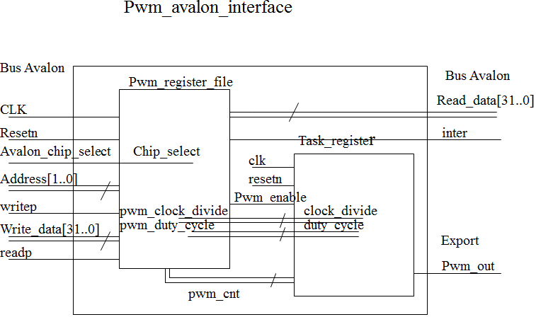
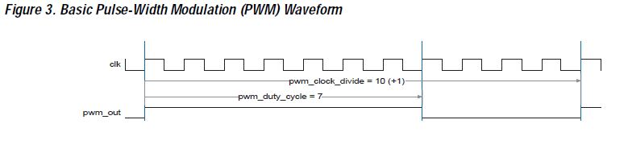
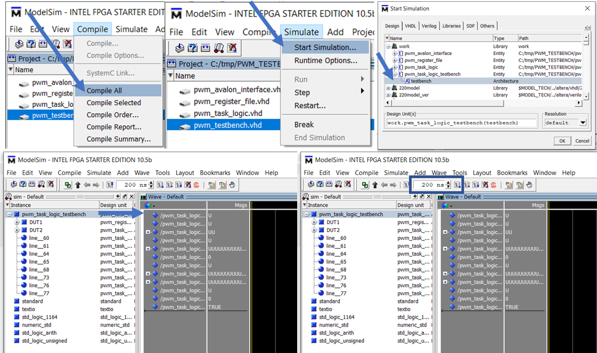
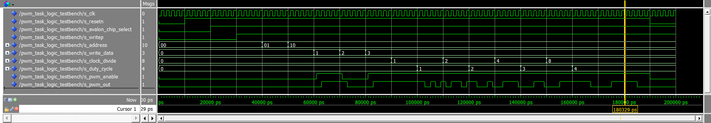
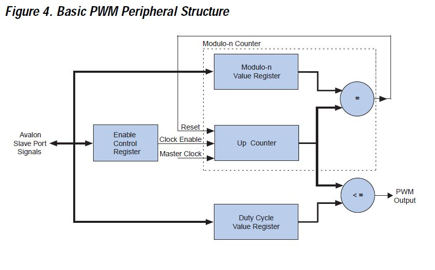
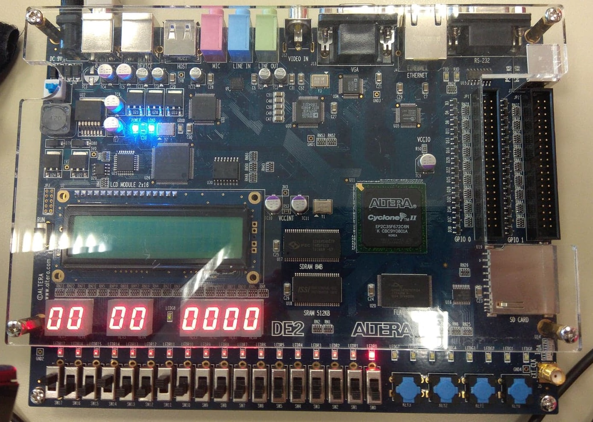
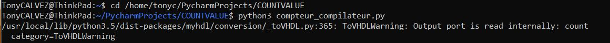

<table>
    <tr>
        <td>CALVEZ Tony </br>CROZON Marine</td>
		<td>FIPA20 </br>Octobre 2018</td>
</table>

## SYSTEME SUR PUCE : Projet PWM

### Introduction

Suite au cours d'électrotechnique et de système sur puce, nous devons mettre au point une technologie pour générer des signaux PWM.

### 1. Mise en place

#### 1.1 Matériel :

Lors de ce projet, nous avons à disposition une maquette de développement (HDK) du constructeur Terasic.  Celui-ci intégre un FPGA de la marque Altera Cyclone II avec de nombreux modules : pins entrées/sorties, afficheurs 7-segments, écran LCD...

#### 1.2 Logiciel :

Nous avons à notre disposition deux technologies avec les codes sources pour le générateur PWM :

- VHDL

  - pwm_avalon_interface.vhd

  - pwm_register_file.vhd

  - pwm_task_logic.vhd
- NIOS II

  - hello_altera_avalon_pwm.c
  - altera_avalon_pwm_routines.c

----------------------


#### 1.3 Architecture :

Le cahier des charges nous impose cette architecture : 




#### 1.4  Comment est généré le PWM?:



-------------------------

### 2. VHDL

#### 2.1 Qu'est ce que le VHDL?

Le VHDL est un langage de programmation qui décrit le matériel et son comportement. Couplé avec un FPGA, celui-ci peut gérer le parallélisme.

#### 2.2 Le Code Source:

Nous avons un code VHDL par composant présent dans notre projet.

##### 2.2.1 Interprétation de `pwm_task_logic.vhd`:

Ce fichier comporte les pins suivants :

- Entrées : 
  - `clk` :  horloge de notre système
  - `resetn` : bit à 0 = arrêt du système
  - `pwm_enable` : bit de "start and stop" du PWM
  - `clock_divide` et `duty_cycle` : génère le rapport cyclique du PWM
- Sortie :
  - `pwm_out` : signal de sortie du PWM

Le code réalise la tache de générer un signal PWM avec un rapport cyclique particulier en modifiant la largueur d'impulsion.

##### 2.2.2 Interprétation de `pwm_register_file.vhd`:

Les pins importants de ce module sont les suivants:

- Entrées :
  - `clk` :  horloge de notre système
  - `resetn` : bit à 0 = arrêt du système
  - `chip_select` : Entrée 1 bit qui signale un transfert en lecture ou écriture
  - `writep` : Valide en transfert en écriture nécessaire pour obtenir les informations de WriteData
  - `address` : change le mode
  - `write_data` : le bit de point faible est recopié
- Sortie :
  - `pwm_enable` : bit de "start and stop" du PWM
  - `clock_divide` et `duty_cycle` : génère le rapport cyclique du PWM

En amont du  `pwm_task_logic.vhd`, nous avons le fichier `pwm_register_file.vhd` qui va configurer les signaux `pwm_clock_divide`, `pwm_duty_cycle`, `pwm_enable`.

--------------------------------

### 3. Réalisation d'un testbench

Pour vérifier que le générateur s'éxécute correctement en VDHL, nous devons fabriquer un testbench. Nous avons fait le choix de tester dans un premier temps le pwm_task_logic.vhd puis après nous avons intégré pwm_register_file.vhd.

#### 3.1 Démonstration du Code:

Nous commencons par importer les bibliothèques associées au code VHDL: 

````vhd
library ieee;
use ieee.std_logic_1164.all;
use ieee.numeric_std.all;
````


Nous nommons notre testbench:

````vhdl
entity pwm_task_logic_testbench is
end pwm_task_logic_testbench;
````


Nous intégrons une architecture, revient à dire que nous créons un composant qui sera capable de se greffer afin de générer des signaux en entrée et pouvoir lire les signaux en sortie.

````vhdl
architecture testbench of pwm_task_logic_testbench is
CODE
end testbench;
````


A l'intérieur de l'architecture, nous appelons nos signaux / variables. Les noms sont similaires aux noms des signaux présents de task_logic ou register_file pour faciliter la compréhension du code.

`````vhdl
---------------- pwm_register_file
signal s_resetn             : std_logic;
signal s_avalon_chip_select : std_logic;
signal s_address            : std_logic_vector (1 downto 0);
signal s_writep             : std_logic;
signal s_write_data         : std_logic_vector (31 downto 0);
signal s_readp              : std_logic := '0';
signal s_pwm_enable         : std_logic;
----------------- pwm_task_logic
signal s_clock_divide       : std_logic_vector (31 downto 0);
signal s_duty_cycle         : std_logic_vector (31 downto 0);
signal s_pwm_out            : std_logic;
-----------------
constant HALF_PERIOD        : time := 1 ns;
signal s_clk                : std_logic :='0';
signal running              : boolean :=true;
`````


Par la suite, nous devons connecter notre testbench avec task_logic ou register_file afin de réaliser un   `port map`. 

Afin de simuler les deux simultanément, nous devons inscrire les entrées et sorties de chacun dans un `DUT` différent. 

Le `DUT` est un "Design Under Test", c'est à dire le composant à éprouver via le testbench (comme si on venait le plugger sur une platine de test), ici le simulateur PWM. Pour synchroniser les signaux `clk`, `resetn`, `pwm_enable` , nous devons les inscrire deux fois dans le  `port map` .

````vhdl
DUT1: entity work.pwm_register_file(syn)
    port map (
      CLK                 => s_clk,
      RESETN              => s_resetn,
      PWM_ENABLE          => s_pwm_enable,
      CHIP_SELECT         => s_avalon_chip_select,
      ADDRESS             => s_address,
      WRITEP              => s_writep,
      WRITE_DATA          => s_write_data,
      READP               => s_readp
    );

DUT2: entity work.pwm_task_logic(syn)
    port map (
      CLK                 => s_clk,
      RESETN              => s_resetn,
      PWM_ENABLE          => s_pwm_enable,
      CLOCK_DIVIDE        => s_clock_divide,
      DUTY_CYCLE          => s_duty_cycle,
      PWM_OUT             => s_pwm_out
    );
````


Nous devons mettre à l'état haut notre signal `pwm_out`à partir du code de `pwm_task_logic.vhd` et `pwm_register_file.vhd` .

Suite à nos recherches, nous avons déduit que :

```mathematica
pwn_out = {
    s_resetn = 1
    s_avalon_chip_select = 1
    s_writep = 1
    s_address = 1
	s_write_data  = 0 || s_write_data  > 0
	s_clock_divide = 0 || s_clock_divide > 0
	s_duty_cycle = 0 || s_duty_cycle > 0
}
```

-------------------------

Dans cette dernière partie, nous simulons des états hauts ou des états bas pour notre système.

**Explication** :

```vhdl
signal1 <= '0', '1' after 10 ns
```

Ici, notre signal n°1 aura la valeur binaire '0' au démarrage puis '1' après 10 ns dans la simulation.

Nous obtenons : 

```vhdl
s_clk <= not(s_clk) after HALF_PERIOD when running else '0';
s_resetn <= '0', '1' after 10 ns, '0' after 190 ns;

--valid_write = 1 si :
s_avalon_chip_select <= '0', '1' after 20 ns;
s_writep <= '0', '1' after 30 ns;

--enable_reg_selected = 1 si : 
s_address <= "00", "01" after 40 ns, "10" after 50 ns;

--write_to_enable = 1

-- copie de la dernière valeur de s_write_data 
s_write_data <= x"00000000", x"00000001" after 60 ns, x"00000002" after 70 ns, x"00000003" after 80 ns;

-- variation rapport cyclique
s_clock_divide <= x"00000000", x"00000001" after 90 ns, x"00000002" after 110 ns, x"00000004" after 130 ns, x"00000008" after 150 ns;
s_duty_cycle <= x"00000000", x"00000001" after 100 ns, x"00000002" after 120 ns, x"00000003" after 140 ns, x"00000004" after 160 ns;


```

-----------------------

#### 3.2 Démonstration sur ModelSim

##### 3.2.1 Démarrage :




##### 3.2.2 Simulation :



-----------------------------------

### 4. Langage C

#### 4.1 Du code VHDL au Code C

Nous pouvons faire l'analogie entre le code C et le code VHDL.

##### 4.1.1 pwm_enable

Nous observons que la fonction C importe toujours les données :

- address 

- duty_cycle

- clock_divider


**SCHEMATIQUE : **



--------------------------

**VHDL -  `pwm_register_file.vhd`**

```VHDL
enable_reg_selected       <=  address(1) and  not(address(0)); 
valid_write <= chip_select and writep;
write_to_enable       <= valid_write and enable_reg_selected;

  process (clk, resetn)
  begin  -- process
    if resetn = '0' then                -- asynchronous reset (active low)
      enable_register <= '0';
    elsif clk'event and clk = '1' then  -- rising clock edge
      if write_to_enable = '1' then
        enable_register <= write_data(0);
      else
        enable_register <= enable_register;
      end if;
    end if;
  end process;

pwm_enable <= enable_register;
```

**Code C - `altera_avalon_pwm_routines.c`**

```c
int altera_avalon_pwm_enable(unsigned int address)
{
  IOWR_ALTERA_AVALON_PWM_ENABLE(address, ALTERA_AVALON_PWM_ENABLE_MSK);
  int altera_avalon_pwm_init(unsigned int address, unsigned int clock_divider, unsigned int duty_cycle)
{
	if(duty_cycle > clock_divider)  //duty cycle reg must be less than or equal to clock divider
	{
		return ALTERA_AVALON_PWM_DUTY_CYCLE_GREATER_THAN_CLOCK_CYCLE_ERROR;
	}
	else
	{
		IOWR_ALTERA_AVALON_PWM_CLOCK_DIVIDER(address, clock_divider - 1);
		IOWR_ALTERA_AVALON_PWM_DUTY_CYCLE(address, duty_cycle);
	}
	 return ALTERA_AVALON_PWM_OK;
}
  if(IORD_ALTERA_AVALON_PWM_ENABLE(address) != ALTERA_AVALON_PWM_ENABLED) //Confirm PWM is enabled
  {
  	return ALTERA_AVALON_PWM_ENABLED_CONFIRMATION_ERROR;
  }
  return ALTERA_AVALON_PWM_OK;
}
```

Nous pouvons observer sur cet exemple que le code C écrit les valeurs sur le bus Avalon vers le   `pwm_register_file.vhd` créé en VHDL.

### 5. Téléversement du code

#### 5.1 Implémentation sur DE2

Nous avons implémenté avec Quartus II sur NIOS II. 

Le NIOS II a été généré au préalable dans le projet avec le professeur. 

Attention lors de la détection automatique de l'USB Blaster, les pilotes n'ont pas détecté notre DE2, il suffit d'importer le SOF File présent dans le projet.

Nous pouvons maintenant téléverser sur la carte l'ensemble de notre projet à partir d'Eclipse.

#### 5.2 Démonstration



Nous observons que le PWM est simulé sur une LED pour faciliter la visualisation du fonctionnement. Toutefois pour être bien, il aurait été logique que si notre carte était connectée à un circuit de puissance, nous aurions mis en sorti un PIN pour y connecter un transistor de puissance.

-------------------------

### 6. Allons plus loin...

#### 6.1 Bibliothèque MyHDL

MyHDL est une bibliothèque open source pour le langage python permettant de convertir des scripts Python en VHDL ou Verilog.

#### 6.2 Repartir sur notre compteur

Nous décidons de tester le module.

Le projet se sépare en deux parties :

- un script avec notre composant

- un script pour la compilation et les signaux


  **compteur.py**

```python
from myhdl import block, always_seq
@block
def compteur(count, enable, clock, reset):
    @always_seq(clock.posedge, reset=reset)
    def plusun():
        if enable:
            count.next = count + 1

    return plusun
```

​	**compteur_compile.py**

```python
from myhdl import Signal, ResetSignal, modbv
from compteur import *

def compteur_compilateur():
    "On déclare les signaux et on compile avec ce fichier"
    m = 8
    count = Signal(modbv(0)[m:])
    enable = Signal(bool(0))
    clock  = Signal(bool(0))
    reset = ResetSignal(0, active=0, async=True)
    compiler = compteur(count, enable, clock, reset)
    compiler.convert(hdl=('VHDL'))
    
compteur_compilateur()
```

Nous exécutons :



-------------------

Et nous pouvons observer que le fichier VHDL suivant a été généré:

```vhdl
-- File: compteur.vhd
-- Generated by MyHDL 0.10
-- Date: Wed Oct  3 15:18:29 2018

library IEEE;
use IEEE.std_logic_1164.all;
use IEEE.numeric_std.all;
use std.textio.all;

use work.pck_myhdl_010.all;

entity compteur is
    port (
        count: inout unsigned(7 downto 0);
        enable: in std_logic;
        clock: in std_logic;
        reset: in std_logic
    );
end entity compteur;


architecture MyHDL of compteur is
begin
COMPTEUR_ADDONE: process (clock, reset) is
begin
    if (reset = '0') then
        count <= to_unsigned(0, 8);
    elsif rising_edge(clock) then
        if bool(enable) then
            count <= (count + 1);
        end if;
    end if;
end process COMPTEUR_ADDONE;

end architecture MyHDL;
```


Nous aurions souhaité téléverser dans la carte DE2, or Quartus refuse de compiler car le second fichier VHDL servant de bibliothèque souhaite écriture dans une mémoire non permise en écriture.