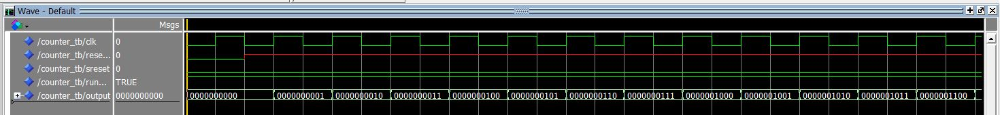

<table>
    <tr>
        <td>CALVEZ Tony</td>
		<td>FIPA20 </br>Mai 2019</td>
</table>


## SYSTEME SUR PUCE : FPGA et VHDL

### Introduction

Nous souhaitons approfondir le VHDL pour éventuellement réaliser des projets sur les FPGA.

### 1. Mise en place

#### 1.1 Matériel :

Lors de ce projet, nous avons à disposition un logiciel d'édition comme Sublime Text avec une extension VHDL disponible sur le Package Control et le logiciel de compilation GHDL avec GTKWave ou ModelSim.

Le test bench est généré à partir de l'entity avec un module Ruby développé par Jean-Christophe Le Lann sous le nom de vhdl_tb. Celui-ci est installable à partir d'une commande gem.

#### 1.2 Codes:

Nous devons réaliser les codes suivants :

- VHDL

  - Bascule D
- Bascule D avec N Bits
  - Compteur
- ALU
  - RAM

--------------


#### 1.3 Compilation :

Nous pouvons compiler nos codes à partir de GHDL.

J'ai édité un script pour qu'il puisse exécuter mon code.

```bash
#!/bin/bash
export DISPLAY=:0

rm work-obj93.cf

rm bascule_d_gen.ghw

ghdl -a bascule_d.vhd

ghdl -a bascule_d_tb.vhd

ghdl -e bascule_d_tb

ghdl -r bascule_d_tb --wave=bascule_d.ghw

gtkwave bascule_d.ghw&

```

Suite à une erreur dans mon code de l'ALU, mon module `ghdl -r` a réalisé un stack overflow. Et même après redémarrage et réinstallation, il fut impossible de lancer mes codes. Pour les captures d'écran de ce rapport, j'ai utilisé ModelSim. 

-------------------------

### 2. VHDL

#### 2.1 Bascule D

La bascule D permet de maintenir une valeur et de la ressortir dans le cycle d'horloge suivant.

##### 2.1.1 Entrée et Sortie `bascule_d.vhd`:

Ce fichier comporte les pins suivants :

- Entrées : 
  - `clk` :  horloge de notre système
  - `input` : valeur d'entrée
- Sortie :
  - `output` : valeur de sortie

##### 2.1.2 Code `bascule_d.vhd`:

```vhdl
library ieee;
	use ieee.std_logic_1164.all;
	use ieee.numeric_std.all;

entity bascule_d is
  port (
	clk		: in  std_logic;
	input	: in  std_logic;
	output  : out std_logic
  ) ;
end entity ; -- bascule_d

architecture using_rising_edge of bascule_d is

begin

	process(clk)   --need to use processes to describe registers
	begin		 			   --only clock is necessary
		
		if rising_edge(clk) then	--or : clk ' event and clk = '1'
			output <=input;
		end if;
	end process;
	
end using_rising_edge ; -- arch
```

##### 2.1.2  TestBench `bascule_d_tb.vhd`:

Le test bench est généré à partir de la commande : `vhdl_tb bascule_d.vhd`

J'ai ajouté le stimuli suivant :

```vhdl
input <= '0','1' after 100 ns, '0' after 200 ns;
```


##### 2.1.3 ModelSim `bascule_d_tb.vhd`:


Nous pouvons observer que nous maintenons bien une valeur puis elle est libérée au coup d'horloge suivant.


----------------------

#### 2.2 Bascule D avec N Bits

La bascule D permet de maintenir une valeur et de la ressortir dans le cycle d'horloge suivant.

##### 2.2.1 Entrée et Sortie `bascule_d.vhd`:

Ce fichier comporte les pins suivants :

- Entrées : 
  - `clk` :  horloge de notre système
  - `input` : valeur d'entrée avec n bit en vecteur
- Sortie :
  - `output` : valeur de sortie avec n bit en vecteur

##### 2.2.2 Code `bascule_d.vhd`:

```vhdl
library ieee;
	use ieee.std_logic_1164.all;
	use ieee.numeric_std.all;

entity bascule_d_nbbits is
	generic (nb_bit : natural := 8);
  port (
  	reset_n : in  std_logic;	
	clk		: in  std_logic;
	input	: in  std_logic_vector(nb_bit-1 downto 0);
	output  : out std_logic_vector(nb_bit-1 downto 0)
  );
end entity ; -- bascule_d_nbbits

architecture using_rising_edge of bascule_d_nbbits is
	signal data : std_logic_vector(nb_bit-1 downto 0);
begin

	basc_gen_proc : process(reset_n, clk) 
		
		if reset_n = '0' then	
			data <= (others => '0'); 
		elsif rising_edge(clk) then	
			data <= input;
		end if;
	end process;
	
	output <= data;
	
end using_rising_edge ;
	
end using_rising_edge ; -- arch
```

##### 2.2.2  TestBench `bascule_d_tb.vhd`:

Le test bench est généré à partir de la commande : `vhdl_tb bascule_d.vhd`

J'ai ajouté le stimuli suivant :

```vhdl
input <= "00000000","00000001" after 100 ns, "11111111" after 200 ns;
```


##### 2.2.3 ModelSim `bascule_d_tb.vhd`:


Nous pouvons observer que nous maintenons bien une valeur puis elle est libérée au coup d'horloge suivant.

-----------------------

#### 2.3 Compteur

Le compteur doit incrémenter à partir d'un bouton et à chaque front montant du click, celui-ci ajoute + 1 à la valeur de sortie jusqu'à 1000.

##### 2.3.1 Entrée et Sortie `counter.vhd`:

Ce fichier comporte les pins suivants :

- Entrées : 
  - `clk` :  horloge de notre système
  - `input` : simule le bouton
- Sortie :
  - `output` : valeur de sortie avec n bit en vecteur

##### 2.3.2 Code `counter.vhd`:

```vhdl
library ieee;
	use ieee.std_logic_1164.all;
	use ieee.numeric_std.all;

entity counter is
	port (
	clk 		: in std_logic;
	input 		: in std_logic;
	output 		: out std_logic_vector(3 downto 0)
	);
end counter;
architecture bhv of counter is
 signal s_output : unsigned(3 downto 0);
 begin
 process (clk)
 	begin
 		if rising_edge(clk) then
	 		if (input = '1') then
	 			if s_output >= "1000" then
	 				s_output <= "0000";
	 			else
	 				s_output <= s_output + 1;
	 			end if;
	 		end if;
 		end if;
 		output <= std_logic_vector(s_output);
 	end process;
 end;
```

##### 2.3.2  TestBench `counter_tb.vhd`:

Le test bench est généré à partir de la commande : `vhdl_tb counter.vhd`

J'ai ajouté le stimuli suivant :

```vhdl
     input <= '1';
     wait_cycles(1);
     input <= '0';
     wait_cycles(1);
     input <= '1';
     wait_cycles(1);
     input <= '0';
     wait_cycles(1);
     output <= "0111";
     wait_cycles(1);
     input <= '1';
     wait_cycles(1);
     input <= '0';
     wait_cycles(100);
```


##### 2.3.3 ModelSim `coounter_tb.vhd`:



Nous pouvons observer que le code ne fonctionne pas. En effet, le input ne change jamais de valeur.

-------------------------

#### 2.4 ALU

Après avoir passer quelques heures, j'ai pu finaliser le fonctionnement. Il est facile de penser que nous avons réaliser ce type d'interpréteur de VM l'année dernière avec Python. Il était donc intéressant de le réaliser en VHDL.

##### 2.4.1 Entrée et Sortie alu.vhd`:

Ce fichier comporte les pins suivants :

- Entrées : 
  - `clk` :  horloge de notre système
  - `a` : valeur d'entrée avec n bit en vecteur
  - `b` : valeur d'entrée avec n bit en vecteur
  - `sel`: choix de l'opérateur
- Sortie :
  - `result` : valeur de sortie avec n bit en vecteur

##### 2.4.2 Code `alu.vhd`:

```vhdl
library ieee;
	use ieee.std_logic_1164.all;
	use ieee.numeric_std.all;

entity alu is
	port (
	  	clk		: in  std_logic;
		a 		: in signed(3 downto 0);
		b 		: in signed(3 downto 0);
	 	sel 	: in std_logic_vector(2 downto 0);
	 	result 	: out signed(3 downto 0)
	);
	
end entity alu;

architecture rising_edge of alu is
begin

	basc_proc : process(clk)
	begin
		case sel is 
			when "000" => 
				result<= a + b; --addition 
			when "001" => 
				result<= a - b; --subtraction 
			when "010" =>
				result <= unsigned (a) * unsigned (b); 
			when "011" => 
				result<= a and b; --AND gate 
			when "100" => 
				result<= a or b; --OR gate
			when "101" => 
				result<= a xor b; --XOR gate 
			when "110" => 
				result<= not a ; --NOT gate 
			when others =>
				NULL;
		end case;
	
	end process;
	
end rising_edge;
```

##### 2.4.2  TestBench `alu_tb.vhd`:

Le test bench est généré à partir de la commande : `vhdl_tb alu.vhd`

J'ai ajouté le stimuli suivant :

```vhdl
      a <= "0001";
      b <= "1111";
      sel <= "000";
      wait for 100 ns;
      sel <= "001";
      wait for 100 ns;
      sel <= "010";
      wait for 100 ns;
      sel <= "011";
      wait for 100 ns;
      sel <= "100";
      wait for 100 ns;
      sel <= "101";
      wait for 100 ns;
      sel <= "110";
      wait for 100 ns;
      sel <= "111";
```


##### 2.4.3 ModelSim `alu_tb.vhd`:


Nous pouvons observer que le résultat est identique au code python développé l'année dernière. Mais les performances sont sans doute bien meilleures.

-----------------------

#### 2.5 RAM

Le dernier programme permet de fabriquer une zone de RAM de 128 bits. La gestion de la mémoire est généralement compliquée dans le FPGA. 

##### 2.5.1 Entrée et Sortie `ram.vhd`:

Ce fichier comporte les pins suivants :

- Entrées : 
  - `clk` :  horloge de notre système
  - `a` : valeur d'entrée avec n bit en vecteur
  - `b` : valeur d'entrée avec n bit en vecteur
  - `sel`: choix de l'opérateur
- Sortie :
  - `result` : valeur de sortie avec n bit en vecteur

##### 2.5.2 Code `ram.vhd`:

Le code est inspiré de celui disponible sur Moodle.

```vhdl
library ieee;
	use ieee.std_logic_1164.all;
	use ieee.numeric_std.all;
	

entity ram is
  port( 
     reset_n : in  std_logic;
     clk     : in  std_logic;
     wr      : in  std_logic;
     address : in  unsigned(7 downto 0);
     datain  : in  std_logic_vector(7 downto 0);
     dataout : out std_logic_vector(7 downto 0)
  );
end entity;

architecture rtl of ram is
  type memory_type is array(0 to 127) of std_logic_vector(7 downto 0);
  signal mem    :   memory_type;
  signal addr_r :   unsigned(7 downto 0);
begin

  ram_proc : process(reset_n,clk)
   begin
    
	if reset_n='0' then
      for i in 0 to 127 loop
        mem(i) <= (others => '0');
      end loop;
      addr_r <= to_unsigned(0,8);
    
	elsif rising_edge(clk) then
      if wr='1' then
        mem(to_integer(unsigned(address))) <= datain;
      end if;
      addr_r <= address;
    end if;
  end process;

  dataout <= mem(to_integer(addr_r));

end rtl;
```

##### 2.5.2  TestBench `ram_tb.vhd`:

Le test bench est généré à partir de la commande : `vhdl_tb ram.vhd`

J'ai ajouté le stimuli suivant :

```vhdl
	 wr <= '1';
     for i in 0 to 127 loop
       wait_cycles(10);
       address <= to_unsigned(i,8);
       datain <= std_logic_vector(to_unsigned(i,8));
     end loop;
     wr <= '0';
	 wait_cycles(100);

```

##### 3.5.3 ModelSim `ram_tb.vhd`:


Le résultat répond à nos attentes.

---------------------

### Conclusion

Nous avons travaillé en équipe et individuellement à la fois. Ceci m'a permis d'en apprendre plus sur le VHDL et maîtriser un peu plus le langage.